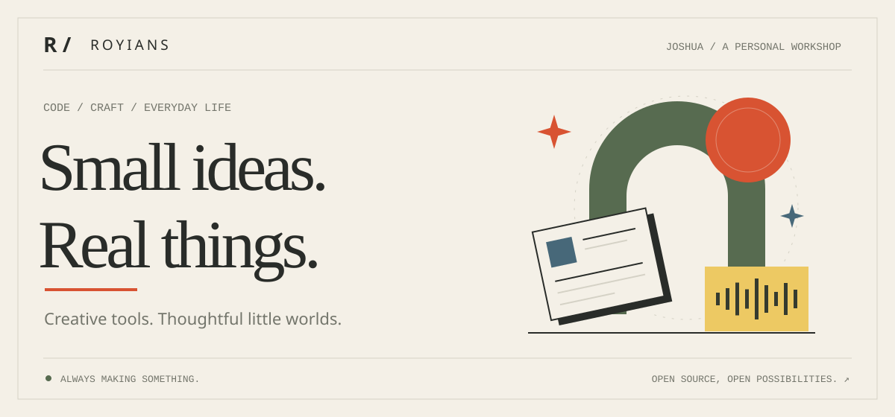
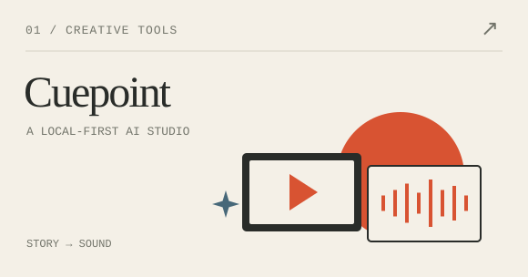
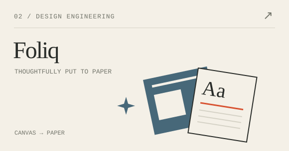
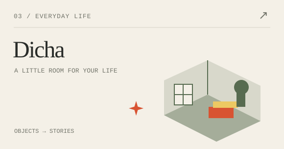
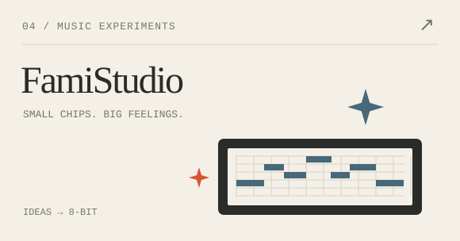
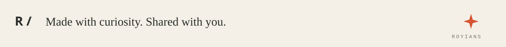

<picture>
  <source media="(prefers-color-scheme: dark)" srcset="assets/hero-dark.svg">
  
</picture>

  <a href="#selected-work">精选项目</a> &nbsp; / &nbsp;
  <a href="#the-workbench">工作台</a> &nbsp; / &nbsp;
  <a href="https://github.com/ROYIANS?tab=repositories">全部仓库 ↗</a> &nbsp; / &nbsp;
  <a href="https://afdian.com/a/ROYIANS">爱发电 ↗</a>

### 嗨，我是 Joshua，也叫 ROYIANS。

我喜欢把想法做成可以亲手使用的东西：从分镜、声音和文档，到房间里的一本书、一件小物。
最近在探索 AI 与创作工具，也一直在做那些让日常多一点温度的小项目。

**让创作更自由，让工具更顺手，让生活保留一点趣味。**

 

## Selected work · 做出来的想法

<table>
  <tr>
    <td width="50%" valign="top">
      <a href="https://github.com/ROYIANS/Cuepoint">
        <picture>
          <source media="(prefers-color-scheme: dark)" srcset="assets/cuepoint-dark.svg">
          
        </picture>
      </a>
      <h3><a href="https://github.com/ROYIANS/Cuepoint">Cuepoint · 小光点</a></h3>
      
把故事、分镜、声音和音乐放进同一个 AI 创作工作室。项目保存在浏览器，模型由你选择。

      
<code>React</code> <code>TypeScript</code> <code>IndexedDB</code>

      
<a href="https://cue.vidorra.life/">打开工作室 ↗</a> &nbsp; <a href="https://github.com/ROYIANS/Cuepoint">源码 ↗</a>

    </td>
    <td width="50%" valign="top">
      <a href="https://github.com/ROYIANS/foliq-print-template-designer">
        <picture>
          <source media="(prefers-color-scheme: dark)" srcset="assets/foliq-dark.svg">
          
        </picture>
      </a>
      <h3><a href="https://github.com/ROYIANS/foliq-print-template-designer">Foliq</a></h3>
      
从画布到纸张的文档设计器。连接可视化编辑、数据绑定、版本管理与确定性 PDF 输出。

      
<code>React</code> <code>NestJS</code> <code>PDF</code>

      
<a href="https://foliq.vidorra.life/">打开设计器 ↗</a> &nbsp; <a href="https://github.com/ROYIANS/foliq-print-template-designer">源码 ↗</a> &nbsp; v2 重写中

    </td>
  </tr>
  <tr>
    <td width="50%" valign="top">
      <a href="https://github.com/ROYIANS/dicha">
        <picture>
          <source media="(prefers-color-scheme: dark)" srcset="assets/dicha-dark.svg">
          
        </picture>
      </a>
      <h3><a href="https://github.com/ROYIANS/dicha">Dicha · 滴茶</a></h3>
      
给生活里的小物一个位置。用房间整理物品，也留下它们的照片、故事和被记住的理由。

      
<code>React</code> <code>NestJS</code> <code>Prisma</code>

      
<a href="https://github.com/ROYIANS/dicha">走进小屋 ↗</a> &nbsp; Pre-alpha · 持续生长中

    </td>
    <td width="50%" valign="top">
      <a href="https://github.com/ROYIANS/famistudio-compose-skill">
        <picture>
          <source media="(prefers-color-scheme: dark)" srcset="assets/famistudio-dark.svg">
          
        </picture>
      </a>
      <h3><a href="https://github.com/ROYIANS/famistudio-compose-skill">FamiStudio Compose</a></h3>
      
让 AI 参与 NES 芯片音乐创作。从作曲计划、乐谱编辑到校验与渲染，把灵感变成能听见的旋律。

      
<code>TypeScript</code> <code>Agent Skill</code> <code>Chiptune</code>

      
<a href="https://github.com/ROYIANS/famistudio-compose-skill/tree/main/boss-chase">听听 Boss Chase ↗</a> &nbsp; <a href="https://github.com/ROYIANS/famistudio-compose-skill">源码 ↗</a>

    </td>
  </tr>
</table>

 

## The workbench · 还在折腾什么

- **[Wabi · 侘](https://github.com/ROYIANS/Wabi)** — 把习惯、日程、身体记录与 AI 辅助安排放在一起的生活应用。 持续开发
- **[TheTwo · 择途](https://github.com/ROYIANS/TheTwo)** — 从真实经历出发，探索以个人为中心的 AI 职业决策。 产品设计阶段
- **[Dreamland Book · 梦岛书](https://github.com/ROYIANS/hexo-theme-dreamlandbook)** — 为文字留一处空间，一款基于 Maple 修改的 Hexo 博客主题。 早期作品

 

### 常用的工具

  <code>TypeScript</code> &nbsp; <code>React</code> &nbsp; <code>Vite</code> &nbsp;
  <code>Tailwind CSS</code> &nbsp; <code>NestJS</code> &nbsp; <code>Prisma</code> &nbsp;
  <code>PostgreSQL</code> &nbsp; <code>Docker</code>

比起技术清单，我更在意工具最终落到谁的手里，又让哪件小事变得容易了一点。

 

---

### 支持创作 · 请我喝杯茶

如果这些项目恰好帮到了你，欢迎通过爱发电支持我的开源创作，让这些小小的想法继续生长。

**[在爱发电支持我 ↗](https://afdian.com/a/ROYIANS)**

一颗 Star、一条反馈，也都是继续做下去的动力。谢谢你来逛我的小小工作室。

<picture>
  <source media="(prefers-color-scheme: dark)" srcset="assets/footer-dark.svg">
  
</picture>
