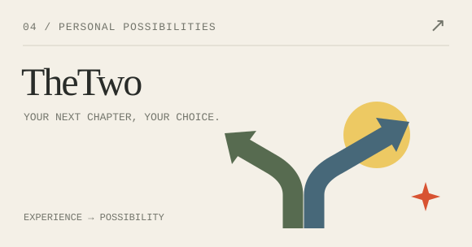

<picture>
  <source media="(prefers-color-scheme: dark)" srcset="assets/hero-dark.svg">
  
</picture>

  <a href="#selected-work">精选项目</a> &nbsp; / &nbsp;
  <a href="#the-workbench">工作台</a> &nbsp; / &nbsp;
  <a href="https://github.com/ROYIANS?tab=repositories">全部仓库 ↗</a> &nbsp; / &nbsp;
  <a href="https://vidorra.life/">博客 ↗</a> &nbsp; / &nbsp;
  <a href="https://afdian.com/a/ROYIANS">爱发电 ↗</a>

### 嗨，我是 Joshua，也叫 ROYIANS。

我喜欢把想法做成可以亲手使用的东西：从分镜、声音和文档，到房间里的一本书、一件小物。
最近在探索 AI 与创作工具，也一直在做那些让日常多一点温度的小项目。

**让创作更自由，让工具更顺手，让生活保留一点趣味。**

 

## Selected work · 做出来的想法

<table>
  <tr>
    <td width="50%" valign="top">
      <a href="https://github.com/ROYIANS/Cuepoint">
        <picture>
          <source media="(prefers-color-scheme: dark)" srcset="assets/cuepoint-dark.svg">
          
        </picture>
      </a>
      <h3><a href="https://github.com/ROYIANS/Cuepoint">Cuepoint · 小光点</a></h3>
      
把故事、分镜、声音和音乐放进同一个 AI 创作工作室。项目保存在浏览器，模型由你选择。

      
<code>React</code> <code>TypeScript</code> <code>IndexedDB</code>

      
<a href="https://cue.vidorra.life/">打开工作室 ↗</a> &nbsp; <a href="https://github.com/ROYIANS/Cuepoint">源码 ↗</a>

    </td>
    <td width="50%" valign="top">
      <a href="https://github.com/ROYIANS/foliq-print-template-designer">
        <picture>
          <source media="(prefers-color-scheme: dark)" srcset="assets/foliq-dark.svg">
          
        </picture>
      </a>
      <h3><a href="https://github.com/ROYIANS/foliq-print-template-designer">Foliq</a></h3>
      
从画布到纸张的文档设计器。连接可视化编辑、数据绑定、版本管理与确定性 PDF 输出。

      
<code>React</code> <code>NestJS</code> <code>PDF</code>

      
<a href="https://foliq.vidorra.life/">打开设计器 ↗</a> &nbsp; <a href="https://github.com/ROYIANS/foliq-print-template-designer">源码 ↗</a> &nbsp; v2 重写中

    </td>
  </tr>
  <tr>
    <td width="50%" valign="top">
      <a href="https://github.com/ROYIANS/dicha">
        <picture>
          <source media="(prefers-color-scheme: dark)" srcset="assets/dicha-dark.svg">
          
        </picture>
      </a>
      <h3><a href="https://github.com/ROYIANS/dicha">Dicha · 滴茶</a></h3>
      
给生活里的小物一个位置。用房间整理物品，也留下它们的照片、故事和被记住的理由。

      
<code>React</code> <code>NestJS</code> <code>Prisma</code>

      
<a href="https://dicha.life/">走进小屋 ↗</a> &nbsp; <a href="https://github.com/ROYIANS/dicha">源码 ↗</a> &nbsp; Pre-alpha

    </td>
    <td width="50%" valign="top">
      <a href="https://github.com/ROYIANS/TheTwo">
        <picture>
          <source media="(prefers-color-scheme: dark)" srcset="assets/thetwo-dark.svg">
          
        </picture>
      </a>
      <h3><a href="https://github.com/ROYIANS/TheTwo">TheTwo · 择途</a></h3>
      
从真实经历出发，探索以个人为中心的 AI 职业决策。看清机会、理解取舍，让下一步由自己选择。

      
<code>AI</code> <code>Career</code> <code>Open Source</code>

      
<a href="https://royians.github.io/TheTwo/">概念预览 ↗</a> &nbsp; <a href="https://github.com/ROYIANS/TheTwo">项目仓库 ↗</a> &nbsp; 产品设计阶段

    </td>
  </tr>
</table>

 

## The workbench · 还在折腾什么

- **[图来 · TULAI](https://tulai.design/)** — 一个把图片生成 Skill、Agent 工作流和视觉模板整合到一起的产品：用户上传一张图，选择想要的感觉，图来负责分析、组装提示词、调用模型、检查结果并给出可继续 Remix 的成片。 [打开图来 ↗](https://tulai.design/)
- **[FamiStudio Compose](https://github.com/ROYIANS/famistudio-compose-skill)** — 让 AI 参与 NES 芯片音乐创作。从作曲计划、乐谱编辑到校验与渲染，把灵感变成能听见的旋律。 [听听 Boss Chase ↗](https://github.com/ROYIANS/famistudio-compose-skill/blob/main/boss-chase/boss-chase.mp3) · [源码 ↗](https://github.com/ROYIANS/famistudio-compose-skill)
- **[Dreamland Book · 梦岛书](https://github.com/ROYIANS/hexo-theme-dreamlandbook)** — 为文字留一处空间，一款基于 Maple 修改的 Hexo 博客主题。 [我的博客 ↗](https://vidorra.life/) · [源码 ↗](https://github.com/ROYIANS/hexo-theme-dreamlandbook) · 早期作品

 

### 常用的工具

  <code>TypeScript</code> &nbsp; <code>React</code> &nbsp; <code>Vite</code> &nbsp;
  <code>Tailwind CSS</code> &nbsp; <code>NestJS</code> &nbsp; <code>Prisma</code> &nbsp;
  <code>PostgreSQL</code> &nbsp; <code>Docker</code>

比起技术清单，我更在意工具最终落到谁的手里，又让哪件小事变得容易了一点。

 

---

### 支持创作 · 请我喝杯茶

如果这些项目恰好帮到了你，欢迎通过爱发电支持我的开源创作，让这些小小的想法继续生长。

**[在爱发电支持我 ↗](https://afdian.com/a/ROYIANS)**

一颗 Star、一条反馈，也都是继续做下去的动力。谢谢你来逛我的小小工作室。

<picture>
  <source media="(prefers-color-scheme: dark)" srcset="assets/footer-dark.svg">
  
</picture>
